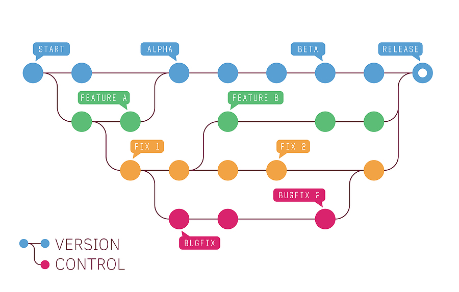
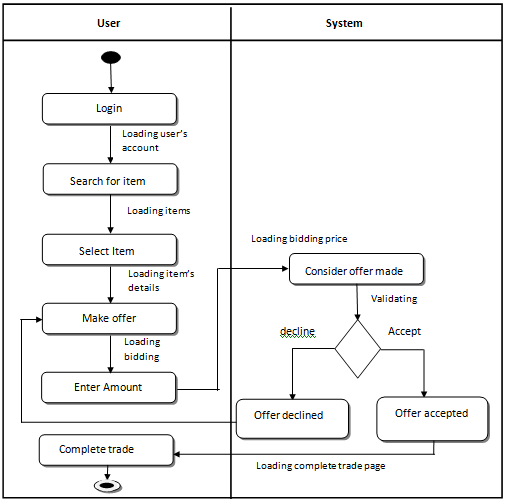

# Buổi 5: DEV THÌ KHÔNG CHỈ VIẾT CODE

## 1. Version Control là gì và tại sao cần dùng nó?

Hệ thống quản lý phiên bản, còn được gọi là Version Control System (VCS), là một hệ thống lưu giữ các phiên bản của mã nguồn của sản phẩm phần mềm. Nó giúp các lập trình viên có thể dễ dàng lấy lại phiên bản mong muốn. VCS rất quan trọng trong quá trình phát triển phần mềm vì nhiều lý do:

- Khôi phục phiên bản cũ: VCS cho phép bạn quay lại một phiên bản xác định nào đó sau này.
- Theo dõi thay đổi: VCS giúp bạn theo dõi ai đã thực hiện thay đổi cuối cùng có thể gây ra sự cố.
- Tránh mất dữ liệu: Khi bạn làm rối tung mọi thứ lên hay vô tình xoá mất các file đi, bạn có thể khôi phục lại chúng một cách dễ dàng.
- Cộng tác: Phần lớn các hệ thống VCS xử lý rất tốt việc quản lý nhiều kho chứa từ xa, vì thế bạn có thể cộng tác với nhiều nhóm người khác nhau theo những cách khác nhau trong cùng một dự án.


Ví dụ về một số hệ thống quản lý phiên bản phổ biến bao gồm Git, Subversion, và Mercurial.

## 2. Các khái niệm về Git: Local Repository, Remote Repository, Branch, Commit, Merge, Pull, Push, Clone, Fork.

- **Local Repository (Kho lưu trữ cục bộ)**: Đây là bản sao của dự án Git được lưu trữ trên máy tính cá nhân của bạn. Bạn có thể làm việc với mã nguồn, thực hiện các thay đổi và tạo commit mà không cần kết nối mạng.
- **Remote Repository (Kho lưu trữ từ xa)**: Đây là phiên bản của dự án được lưu trữ trên một server từ xa (ví dụ: GitHub, GitLab, Bitbucket). Được sử dụng để chia sẻ dự án với người khác và làm việc cộng tác.
- **Branch (Nhánh)**: Đây là một phiên bản song song của dự án, cho phép bạn phát triển các tính năng mới, sửa lỗi hoặc thực hiện các thay đổi mà không ảnh hưởng đến phiên bản chính.
- **Commit**: Một commit là một bản ghi của sự thay đổi trong dự án. Khi bạn thực hiện commit, bạn ghi lại tất cả các thay đổi đã thực hiện từ lần commit trước đó.
- **Merge (Hợp nhất)**: Hành động kết hợp các thay đổi từ một nhánh vào nhánh khác. Thường được sử dụng để kết hợp tính năng hoặc sửa lỗi từ một nhánh vào nhánh chính.
- Câu lệnh: 
```
$ git merge <branch-name>
```
Hoặc:
```
$ git merge <branch-name> <merged-branch-name>
```
- **Pull**: Hành động lấy các thay đổi từ remote repository và hợp nhất chúng vào local repository của bạn. Thực hiện pull để cập nhật mã nguồn của bạn với những thay đổi mới nhất.
- 
Câu lệnh:
```
$ git pull origin [name_branch].
```
- **Push**: Hành động đẩy các commit mới từ local repository lên remote repository để chia sẻ với người khác.
```
$ git push origin <name_branch>
```
- **Clone**: Hành động tạo một bản sao đầy đủ của remote repository trên local machine của bạn. Điều này cho phép bạn làm việc cục bộ trên dự án.

Câu lệnh:
```
git clone /đường-dẫn-đến-repository/
```
- **Fork**: Hành động tạo một bản sao của remote repository vào tài khoản của bạn trên cùng hoặc trên một dự án khác, cho phép bạn tự do thực hiện thay đổi mà không ảnh hưởng đến dự án gốc. Fork thường được sử dụng để đóng góp vào các dự án mã nguồn mở.

## 3. Pull request (PR)

Pull request (PR) là một yêu cầu để hợp nhất các thay đổi từ một nhánh (branch) vào nhánh khác trong hệ thống quản lý phiên bản như GitHub, GitLab, hoặc Bitbucket.

Bạn cần tạo Pull Request khi bạn đã hoàn thành một số công việc trên một nhánh và muốn đề xuất các thay đổi đó được hợp nhất vào nhánh chính hoặc nhánh mục tiêu khác. Đây là cách để cho phép người khác xem xét và kiểm tra các thay đổi của bạn trước khi chúng được hợp nhất vào mã nguồn chính.

Để tạo một Pull Request trên các nền tảng như GitHub, thực hiện các bước sau:

- **Tạo nhánh (Branch)**: Trước tiên, tạo một nhánh từ nhánh mà bạn muốn hợp nhất thay đổi của mình. Thực hiện công việc cần thiết trên nhánh mới này.
- **Commit thay đổi**: Thực hiện các thay đổi và commit chúng vào nhánh mới. Đảm bảo các commit có thông tin rõ ràng và miêu tả chi tiết về các thay đổi.
- **Đẩy (Push) nhánh**: Đẩy nhánh mới với các commit của bạn lên remote repository.
- **Tạo Pull Request**: Trên trang của repository trên nền tảng quản lý phiên bản (ví dụ: GitHub), chọn nhánh bạn vừa đẩy lên và nhấn vào nút "Create Pull Request" hoặc tương tự.
- **Miêu tả và Review**: Điền thông tin mô tả chi tiết về các thay đổi, bao gồm mục tiêu của chúng và bất kỳ thay đổi nào quan trọng. Sau đó, yêu cầu người khác xem xét (review) các thay đổi của bạn.
- **Hợp nhất (Merge)**: Sau khi các thay đổi đã được xem xét và được chấp nhận, người quản lý dự án có thể hợp nhất Pull Request của bạn vào nhánh mục tiêu.
Pull Request giúp tăng tính minh bạch và kiểm soát chất lượng trong quá trình phát triển phần mềm, cho phép mọi người xem xét và cung cấp phản hồi trước khi các thay đổi được hợp nhất vào mã nguồn chính.
## 4. UML (Unified Modeling Language)

UML (Unified Modeling Language) là một ngôn ngữ mô hình hóa chuẩn được sử dụng trong lĩnh vực phát triển phần mềm để mô tả, thiết kế và trình bày các phần mềm trong quá trình phát triển.

Lí do cần sử dụng UML bao gồm:

- **Truyền thông hiệu quả**: UML cung cấp một ngôn ngữ đồ họa và chuẩn để truyền đạt thông tin về các yêu cầu, thiết kế, cấu trúc và chức năng của phần mềm. Điều này giúp làm rõ và tạo sự hiểu biết chung trong đội ngũ phát triển.
- **Phân tích và Thiết kế**: UML cung cấp các loại biểu đồ khác nhau để phân tích yêu cầu, thiết kế hệ thống, và mô tả các quy trình hoạt động. Các biểu đồ UML như lược đồ lớp, lược đồ tuần tự, lược đồ use case, lược đồ hoạt động, và các loại biểu đồ khác giúp trong việc tạo ra các mô hình cho phần mềm.
- **Hiểu rõ hệ thống**: UML giúp những người tham gia dự án phần mềm hiểu rõ cấu trúc và hoạt động của hệ thống. Việc này giúp người phát triển, quản lý và người dùng cuối đều có thể tương tác và làm việc với hệ thống một cách hiệu quả.
- **Tạo tài liệu và hướng dẫn**: Biểu đồ UML có thể được sử dụng để tạo tài liệu mô tả về hệ thống, hướng dẫn sử dụng và tài liệu kỹ thuật, giúp cho việc bảo trì và cập nhật hệ thống trở nên dễ dàng hơn.
## 5. Mô hình Class Diagram, Activity Diagram

Cả hai loại biểu đồ trong UML này đều cung cấp cái nhìn trực quan về phần mềm, nhưng mục tiêu và nội dung của chúng khác nhau.

### Class Diagram (Biểu đồ lớp)

Mục tiêu: Biểu đồ lớp tập trung vào cấu trúc tĩnh của hệ thống, mô tả các lớp trong phần mềm, các thuộc tính của lớp và mối quan hệ giữa các lớp.

Công dụng:

- Mô tả các lớp, gồm các thuộc tính và phương thức của chúng.
- Hiển thị các mối quan hệ giữa các lớp như kế thừa, liên kết, hoặc sự phụ thuộc.
- Là công cụ quan trọng trong thiết kế hướng đối tượng của phần mềm.


### Activity Diagram (Biểu đồ hoạt động)

Mục tiêu: Biểu đồ hoạt động tập trung vào các quy trình hoạt động, các luồng công việc và các hoạt động trong hệ thống.

Công dụng:

- Mô tả các quy trình hoạt động, sự chuyển đổi giữa các trạng thái.
- Hiển thị luồng điều khiển, điều kiện và vòng lặp trong quá trình hoạt động của hệ thống.
- Được sử dụng để mô tả các quy trình kinh doanh, các tác vụ trong hệ thống.


Ví dụ, biểu đồ hoạt động có thể mô tả luồng làm việc của một hệ thống đăng nhập, từ việc nhập thông tin đến xác thực và cấp quyền truy cập.

Cả hai loại biểu đồ đều quan trọng trong việc phát triển phần mềm. Biểu đồ lớp giúp hiểu cấu trúc của hệ thống, trong khi biểu đồ hoạt động tập trung vào các quy trình và hoạt động của hệ thống.

